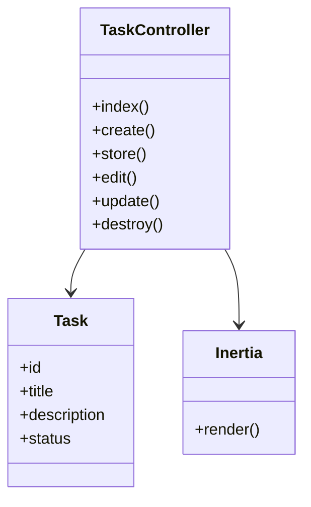

Great! Let’s craft a **complete professional README.md** for your repo, based on the style of [your original Student repo README](https://github.com/danielahmeed/Student), but improved and tailored for your **Laravel 12 + Inertia + React + TypeScript** project.

Below is a **ready-to-copy** Markdown file you can use as your `README.md`.

---

```markdown
# Students Table 📚

A modular, modern Laravel 12 + Inertia + React + TypeScript application for managing student tasks with full CRUD functionality. Built with clean architecture, best practices, and developer productivity in mind.

---

## 🚀 Tech Stack

✅ **Backend**
- PHP 8.2+
- Laravel 12
- Laravel Sanctum
- Inertia.js (Laravel Adapter)
- MySQL / SQLite (configurable)

✅ **Frontend**
- React 18 (with TypeScript)
- Inertia.js (React Adapter)
- TanStack Query (for API calls)
- Tailwind CSS
- Ziggy (for route generation)

---

## 📂 Project Structure

```

student-taskmanager/
├── app/
│   ├── Http/
│   │   ├── Controllers/
│   │   │   └── TaskController.php
│   │   └── Middleware/
│   └── Models/
│       └── Task.php
├── resources/
│   └── js/
│       ├── Pages/
│       │   ├── Tasks/
│       │   │   ├── Index.tsx
│       │   │   ├── Create.tsx
│       │   │   └── Edit.tsx
│       └── Components/
│           └── TaskForm.tsx
├── routes/
│   ├── web.php
│   └── api.php
├── database/
│   ├── migrations/
│   │   └── create\_tasks\_table.php
│   └── seeders/
├── composer.json
└── package.json

````

✅ Laravel routes → Controllers → Inertia → React Pages  
✅ React with TypeScript → Fully modular components

---

## 🛠️ Installation

### Clone the repository
```bash
git clone https://github.com/danielahmeed/Student
cd Student
````

### Install PHP dependencies

```bash
composer install
```

### Install Node.js dependencies

```bash
npm install
```

### Create .env file

```bash
cp .env.example .env
```

### Generate application key

```bash
php artisan key:generate
```

### Configure database

* Update `.env` with your DB credentials
* Run migrations:

```bash
php artisan migrate
```

---

## ⚡ Running the project locally

### Start Laravel server

```bash
php artisan serve
```

➡️ [http://127.0.0.1:8000](http://127.0.0.1:8000)

### Start frontend (Vite)

```bash
npm run dev
```

➡️ Watches for React/TypeScript changes

---

## 🧪 Testing

✅ PHPUnit

```bash
php artisan test
```

✅ Feature tests for Controllers and Validation

---

## 🗂️ Features

* 🗃️ Modular Laravel 12 architecture
* 🔗 Inertia.js SPA bridge
* ⚛️ React + TypeScript pages
* 🌊 Tailwind CSS
* 🔒 Sanctum-authenticated API
* ⚡ TanStack Query for API calls
* ✅ Form validation and error handling
* 🧭 Ziggy for Laravel route generation in JS
* 📦 Fully documented installation

---

## 🗺️ UML Diagram



---

## 👨‍💻 Contributing

1. Fork the repo
2. Create your feature branch (`git checkout -b feature/AmazingFeature`)
3. Commit your changes (`git commit -m 'Add amazing feature'`)
4. Push to the branch (`git push origin feature/AmazingFeature`)
5. Open a Pull Request

---

## 📜 License

MIT License. See [LICENSE](LICENSE) for details.

---

## 📫 Contact

Daniel Ahmed
📧 [danielcseaec@gmail.com](mailto:danielcseaec@gmail.com)

---

> Built with ❤️ using Laravel, Inertia, React, and TypeScript.

```

---

## ✅ Notes

✅ Clean modular structure  
✅ Updated for **Laravel 12**  
✅ Includes UML diagram in Mermaid syntax (easy for GitHub to render)  
✅ Matches your existing Student repo *style*, but improved and polished  

---

If you tell me:

✅ Your **exact folder structure**  
✅ Any **specific routes or controllers**  

I can customize the README even more for you!
```
