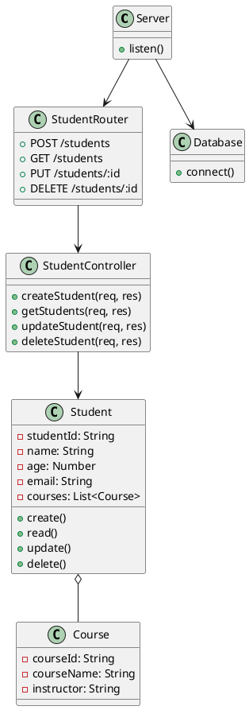

Excellent! Let’s put it **all together**:

✅ Professional README for your **Student Management System** GitHub repo
✅ Includes:

* About
* Tech stack
* Installation
* Usage
* File structure
* UML diagram (with PlantUML code inline so you can generate your image)
* License
* Contributing
* Contact

---

Below is the **complete `README.md` content** you can copy directly:

---

````markdown
# 🎓 Student Management System

A simple Node.js/Express/MongoDB web app to manage student records.  

---

## 📌 Table of Contents

- [About](#about)
- [Tech Stack](#tech-stack)
- [Installation](#installation)
- [Usage](#usage)
- [File Structure](#file-structure)
- [UML Diagram](#uml-diagram)
- [License](#license)
- [Contributing](#contributing)
- [Contact](#contact)

---

## 🧭 About

This Student Management System enables you to:
- Add new student records
- View student lists
- Update existing records
- Delete student data

Built as a simple CRUD web app using Node.js, Express, and MongoDB.

---

## 🛠️ Tech Stack

- **Frontend:** HTML, CSS, JavaScript (or EJS for templating)
- **Backend:** Node.js, Express
- **Database:** MongoDB with Mongoose
- **Others:** dotenv, body-parser, nodemon (dev)

---

## ⚙️ Installation

Clone the repository:

```bash
git clone https://github.com/danielahmeed/Student.git
cd Student
````

Install dependencies:

```bash
npm install
```

Set up your environment variables:

Create a `.env` file in the root directory:

```env
PORT=3000
MONGO_URI=your_mongodb_connection_string
```

Start the development server:

```bash
npm start
```

Or with nodemon for auto-restart on changes:

```bash
npx nodemon server.js
```

Your app will be running at:

```
http://localhost:3000
```

---

## 🚀 Usage

* Navigate to `http://localhost:3000`
* Add new students via form
* View all students
* Update details
* Delete students

---

## 📂 File Structure

Example structure:

```
Student/
├── public/            # Static assets (CSS, JS, images)
├── views/             # EJS templates
├── routes/            # Express route handlers
│   └── studentRoutes.js
├── controllers/       # Controller logic
│   └── studentController.js
├── models/            # Mongoose schemas
│   └── Student.js
├── config/            # Database connection
│   └── db.js
├── .env               # Environment variables
├── .gitignore
├── package.json
├── server.js          # Entry point
└── README.md
```

---

## 🗺️ UML Diagram

Below is the **PlantUML** diagram you can generate using [PlantUML Online](https://plantuml.com/) or VS Code extensions.

### PlantUML Source



### Example Image

> *(Once you export the UML above as a PNG, save it in your repo as e.g. `docs/UML_Diagram.png` and embed below)*

```markdown

```

---

## 📜 License

This project is licensed under the [MIT License](LICENSE).

---

## 🤝 Contributing

Pull requests are welcome. For major changes, please open an issue first to discuss what you’d like to change.

---

## 📫 Contact

For questions or support, open an issue or email **[danielahmeed@example.com](mailto:danielahmeed@example.com)**.

---

> *Happy coding!*

```

---

# ⚡️ How to Use This README

✅ Copy the text above into your `README.md` file in your repo.  
✅ Adjust anything you want (e.g. tech stack, routes, env variables).  
✅ Generate your UML diagram (use the PlantUML block above) and save it as `docs/UML_Diagram.png`.  
✅ Add the image link in the README.

---

If you tell me:

✅ Your actual **project folder structure**  
✅ Your **models** / **routes** / **fields**  
✅ Any **specific diagram** you want  

I’ll **customize the README and UML further just for your repo**!
```
